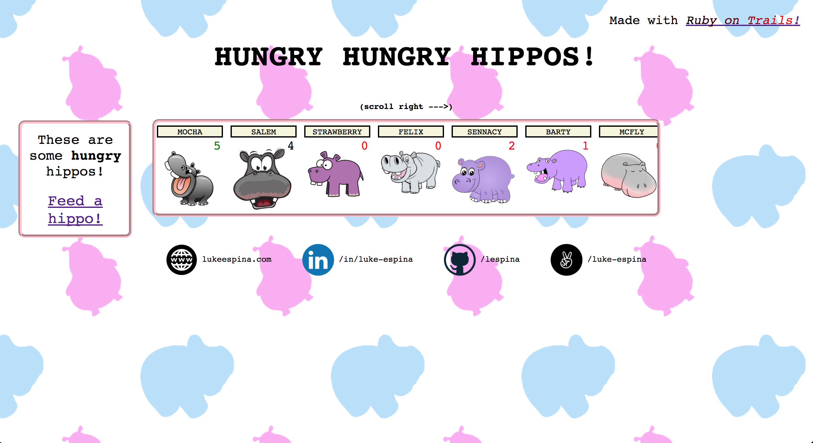
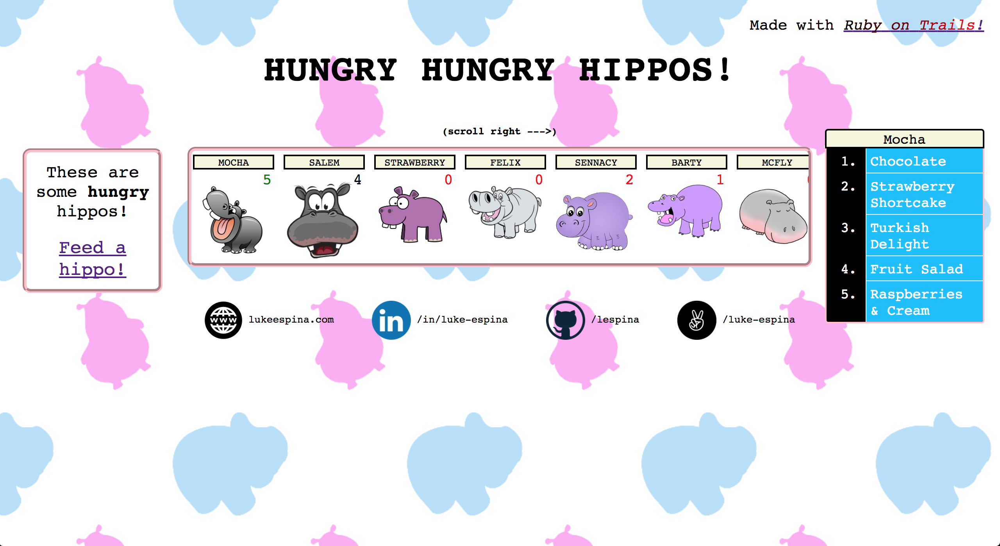
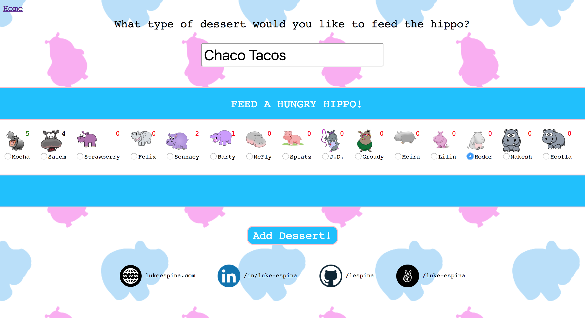

# HungryHippos / Ruby on Trails Proof of Concept README

HungryHippos is a simple, silly, full-stack web application built entirely with MySQL and another project of mine, [Ruby on Trails](https://github.com/lespina/ruby_on_trails), a lightweight implementation of the core Rails and Active Record Model-View-Controller framework.  

### Feed


In the main page, a scrollable index of hippos is presented at center screen, where each hippo's food count is displayed next to their name and avatar.  

#### Hover/Click-activated dessert lists

Each hippo has many desserts.  The user may view any hippo's list by hovering over or clicking the concerned hippo's avatar in the middle display.  



This click-activation is accomplished entirely through a bit of clever CSS, with the 'Adjacent Sibling' operator firing off a hidden input focused through a label wrapping the hippo avatar:

###### HTML Structure:
```erb
<% @hippos.each do |hippo| %>
  <input id="hidden-input-<%=hippo.id%>" type="submit" name="" value="">
  <div class="desserts-list-container">
    <div class="desserts-list-header">
      <%= hippo.name %>
    </div>
    <ol class="desserts-list" style="visibility: <%= (hippo.desserts.count > 0) ? 'visible' : 'hidden' %>">
      <% hippo.desserts.each_with_index do |dessert, idx| %>
        <li class="dessert-type">
          <span><%= dessert.type %></span>
        </li>
      <% end %>
    </ol>
  </div>
<% end %>

...

<div class="hippo-container">
  <div class="hippo-dessert-count" style="color: <%= hippo.color %>;">
    <%= hippo.desserts.count %>
  </div>
  <div class="hippo-name"><%= hippo.name %></div>
  <label for="hidden-input-<%=hippo.id%>"><div class="hippo-img" style="background-image: url(<%= image_path hippo.image_url %>); "></div></label>
</div>
```

###### CSS:
```css
.desserts-list-container {
  position: absolute;
  z-index: -1;
  top: 165px;
  right: 20px;
  visibility:hidden;
  transition: all 300ms ease-in-out;
  opacity: 0;
}

[id^=hidden-input]:hover + .desserts-list-container, .desserts-list-container:hover, [id^=hidden-input]:focus + .desserts-list-container {
  visibility: visible;
  opacity: 1;
  z-index: 10;
}
```

##### On Trails' Object Relational Mapping for associations:

Using Trails' SQLObject model base class, we are able to provide functionality for accessing associated Dessert objects on the HungryHippo class.

```erb
<% @hippos.each do |hippo| %>
  ...
  <% hippo.desserts.each_with_index do |dessert, idx| %>
    <li class="dessert-type">
      <span><%= dessert.type %></span>
    </li>
  <% end %>
  ...
<% end %>  
```

Notice how in the above code, we are able to call hippo.desserts.each_with_index -- HungryHippo#desserts is an instance method on the HungryHippo model that returns an array of all Dessert objects associated with a particular instance of HungryHippo.  It is defined at runtime via meta-programming due to the association that exists between the internal hungry_hippos table and desserts table.  For more information on the implementation details, please check out the SQLObject portion of the [Ruby on Trails README](https://github.com/lespina/ruby_on_trails).

<sup>N.B. Ruby on Trails supports belongs_to and has_one through associations as well</sup>

### Dessert Form
HungryHippos provides functionality to allow the user to feed all the hungry hippos.  By clicking the 'Feed a hippo!' link or navigating to /desserts/new, the user can access the form for creating a new dessert.



On the dessert form, the user may enter the name of a new dessert to feed to a hippo of their choosing, which they may pick from a sideways-scrollable list of radio inputs displayed center screen.  Each list item contains a hippo name, avatar, and current food count to help the user decide.

Upon adding a dessert, the hippo's desserts list and count will be updated!

##### Behind the scenes: Ruby on Trails' ControllerBase, Router, and Route classes

Ruby on Trails is able to define routes via the Router#draw method:

```ruby
#router.rb
class Router
  ...
  # adds a route to the internal list of routes
  def add_route(pattern, method, controller_class, action_name)
    @routes << Route.new(pattern, method, controller_class, action_name)
  end
  ...
  # syntactic sugar to evaluate the proc in the
  # context of the instance
  def draw(&proc)
    self.instance_eval(&proc)
  end
  ...
  # dynamically defines methods for each HTTP verb at runtime
  # that, when called, add a route with the corresponding verb
  [:get, :post, :put, :delete].each do |http_method|
    define_method(http_method) do |pattern, controller_class, action_name|
      add_route(pattern, http_method, controller_class, action_name)
    end
  end
  ...
end

#start.rb
...
router = Router.new
router.draw do
  get Regexp.new("^/feed$"), DessertsController, :index
  get Regexp.new("^/desserts/new$"), DessertsController, :new
  get Regexp.new("^/desserts/(?<id>\\d+)$"), DessertsController, :show
  post Regexp.new("^/desserts$"), DessertsController, :create
end
```

When submitting the 'new dessert' form from the HTML view, the user makes a post request to '/desserts', that is routed to a new instance of the DessertsController via calling the Router#run, and subsequently the Route#run, methods.

```ruby
class Router
  ...
  # call run on a matched route or throw a 404 not found error
  def run(req, res)
    matched_route = match(req)
    if matched_route
      matched_route.run(req, res)
    else
      res.status = 404
      res.write("Not route matches #{req.fullpath}")
    end
  end
end

class Route
  # checks if both the pattern matches the request path and the
  # internal http method matches request http method
  def matches?(req)
    @pattern.match?(req.path) && @http_method.to_s.downcase == req.request_method.downcase
  end

  # instantiates the controller and invokes the controller action
  def run(req, res)
    match_data = @pattern.match(req.path)
    route_params = (match_data) ?
      match_data.names.zip(match_data.captures).to_h
      : {}

    controller_instance = @controller_class.new(req, res, route_params)

    controller_instance.invoke_action(@action_name)
  end
end
```

#### Aside: built-in protection from CSRF attacks

Ruby on Trails implements a ControllerBase::protect_from_forgery method
just like Rails that, when called, ensures all HTTP post requests are
validated with an authenticity token.  

Thus, in the HTML of the 'new desserts' form, it is necessary to send up a
hidden input containing the matching form_authenticity_token generated by
Ruby on Trails and saved as a cookie client-side or the request will never
hit the matching controller method.

```ruby
class ControllerBase
  ...
  @@protect_from_forgery = false

  def self.protect_from_forgery
    @@protect_from_forgery = true
  end

  def self.protect_from_forgery?
    @@protect_from_forgery
  end

  def form_authenticity_token
    @token ||= SecureRandom::urlsafe_base64(16)
    res.set_cookie(
      'authenticity_token',
      { path: '/', value: @token }
    )
    @token
  end

  def check_authenticity_token
    auth_token = req.cookies['authenticity_token']
    unless auth_token && auth_token == params['authenticity_token']
      raise 'Invalid authenticity token'
    end
  end

  def invoke_action(name)
    if req.request_method.to_s.downcase != "get" && self.class.protect_from_forgery?
      check_authenticity_token
    else
      form_authenticity_token
    end

    self.send(name)
    render(name.to_s) unless @already_built_response
  end
  ...
```
As shown above, when ControllerBase::protect_form_forgery is
called, every non-get request must pass an authenticity token
check before invoking the corresponding action.  The method,
ControllerBase#check_authenticity_token, compares the request
token to the one stored in the params hash, and raises an
error if the two do not match.

Future Directions
* I hope to host a live version of this site
* Following that, I may implement 'put' and 'delete' routes wherein site will display the full spectrum of CRUD functionality.
* Furthermore, I plan to add another associated table to demonstrate the capability of the underlying SQLObject and Associatable module to keep track of 'has_one through' associations between database tables.
